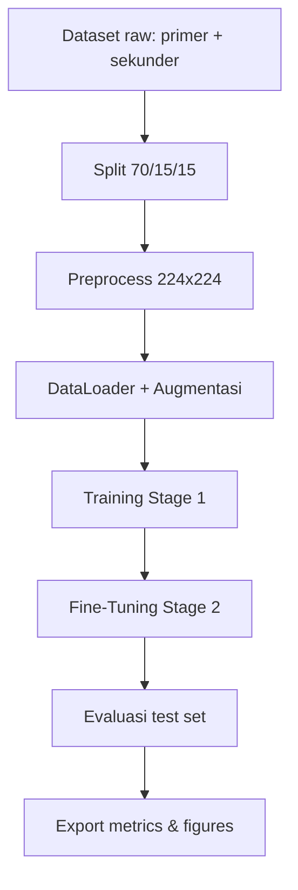

# Tomato Leaf Disease Classification with Deep Learning

Proyek ini membangun sistem klasifikasi penyakit daun tomat berbasis deep learning untuk membedakan 4 kelas citra daun menggunakan pendekatan transfer learning dan feature fusion. Fokus utamanya adalah membandingkan model ringan dan model gabungan agar didapat kompromi terbaik antara akurasi, efisiensi, dan stabilitas training.

## Ringkasan Proyek

Notebook utama [`model.ipynb`](model.ipynb) menjalankan pipeline end-to-end dengan PyTorch: memuat data hasil preprocessing, melatih tiga arsitektur, mengevaluasi performa, lalu mengekspor metrik dan grafik ke folder `reports/`.

### Kelas Prediksi

- `leaf curl`
- `leaf spot`
- `yellowish`
- `healthy leaf`

### Karakteristik Utama

- Transfer learning dengan backbone pretrained ImageNet
- Fine-tuning dua tahap
- Data augmentation pada data train
- Mixed precision training pada GPU
- Early stopping dan learning rate scheduler
- Class-weighted loss untuk ketidakseimbangan data
- Evaluasi multi-metrik: accuracy, precision, recall, F1, confusion matrix, ROC-AUC
- Export hasil analisis ke CSV dan PNG

## Alur Kerja Model

Pipeline penelitian disusun berurutan seperti berikut.



Secara praktis, prosesnya adalah:

1. Dataset mentah dari folder `data/raw/primer` dan `data/raw/sekunder` digabung dan di-split secara stratified.
2. Gambar diproses ulang menjadi ukuran seragam 224x224 menggunakan LANCZOS.
3. Data train diberi augmentasi, sedangkan validation dan test tetap deterministik.
4. Model dilatih dalam dua tahap: training awal lalu fine-tuning.
5. Hasil akhir dibandingkan pada test set dan disimpan ke folder laporan.

## Model yang Digunakan

### 1. MobileNetV2

Model ini dipilih sebagai baseline ringan. Cocok untuk melihat performa model efisien dengan biaya komputasi rendah.

### 2. EfficientNet-B0

Model ini memanfaatkan pendekatan compound scaling untuk menjaga keseimbangan antara akurasi dan efisiensi.

### 3. Fusion Model

Model hybrid menggabungkan feature extractor MobileNetV2 dan EfficientNet-B0. Output fitur dari kedua backbone dikonkatenasi, lalu masuk ke classifier akhir. Pendekatan ini ditujukan untuk menangkap representasi yang lebih kaya dibanding satu backbone tunggal.

```text
Input Image
    ├─> MobileNetV2 feature extractor ─┐
    └─> EfficientNet-B0 feature extractor ─┤
                                          ├─> Concatenation ─> Fully Connected ─> Softmax
                                          └───────────────────────────────────────────────
```

## Teknologi yang Digunakan

### Core ML

- PyTorch
- Torchvision
- scikit-learn

### Data dan Numerik

- NumPy
- Pandas
- Pillow

### Visualisasi dan Analisis

- Matplotlib
- Seaborn

### Environment

- Jupyter Notebook
- CUDA opsional untuk training GPU

## Struktur Project

```text
project-root/
├── model.ipynb
├── requirements.txt
├── src/
│   ├── 01_split_dataset_V1.py
│   ├── 01_split_dataset_V2.py
│   ├── 02_preprocess_V1.py
│   └── 02_preprocess_V2.py
├── data/
│   ├── raw/
│   │   ├── Primer/
│   │   └── Sekunder/
│   ├── splits/
│   └── processed/
├── reports/
│   ├── figures/
│   └── metrics/
├── models/
│   ├── best_model.h5
│   └── checkpoints/
└── logs/
```

## Setup

### 1. Prasyarat

- Python 3.10+ direkomendasikan
- Git
- VS Code atau Jupyter
- GPU NVIDIA opsional, tetapi sangat membantu untuk training lebih cepat

### 2. Clone Repository

```bash
git clone <repo-url>
cd "MODEL 2 (sekunder)"
```

### 3. Buat Virtual Environment

```bash
python -m venv venv_skripsi
```

Aktivasi di Windows PowerShell:

```bash
Set-ExecutionPolicy -Scope Process -ExecutionPolicy RemoteSigned
& "venv_skripsi\Scripts\Activate.ps1"
```

Alternatif CMD:

```bash
venv_skripsi\Scripts\activate.bat
```

### 4. Install Dependensi

```bash
pip install -r requirements.txt
```

Jika ingin menjalankan notebook, pastikan kernel Jupyter memakai environment ini.

## Persiapan Data

Struktur data mentah yang diharapkan:

```text
data/raw/
├── primer/
│   ├── leaf curl/
│   ├── leaf spot/
│   ├── yellowish/
│   └── healthy leaf/
└── sekunder/
    ├── leaf curl/
    ├── leaf spot/
    ├── yellowish/
    └── healthy leaf/
```

Pastikan nama kelas konsisten agar skrip dapat melakukan inferensi label dari struktur folder. Pada Windows, casing folder tidak sensitif, tetapi skrip mengacu ke `data/raw/primer` dan `data/raw/sekunder`, jadi sebaiknya struktur folder disamakan agar tetap portable.

## Jalankan Pipeline

### 1. Split Dataset

Script ini menggabungkan data primer dan sekunder, lalu membaginya menjadi train, validation, dan test dengan proporsi 70:15:15.

```bash
python src/01_split_dataset_V1.py
```

Output yang dihasilkan:

- `data/splits/train.csv`
- `data/splits/validation.csv`
- `data/splits/test.csv`
- `data/splits/all_data.csv`
- Folder split berisi citra per kelas

### 2. Preprocess Dataset

Script preprocessing menstandarkan ukuran gambar menjadi 224x224. Data train memakai random crop, sedangkan validation dan test memakai center crop untuk menjaga konsistensi evaluasi.

```bash
python src/02_preprocess_V2.py
```

Hasil preprocessing disimpan ke:

- `data/processed/train`
- `data/processed/validation`
- `data/processed/test`

### 3. Training dan Evaluasi

Buka dan jalankan [`model.ipynb`](model.ipynb).

Notebook ini akan:

- memuat dataset dari `data/processed/`
- melakukan augmentasi dan normalisasi
- melatih MobileNetV2, EfficientNet-B0, dan Fusion Model
- menyimpan checkpoint terbaik ke `models/checkpoints/`
- menghasilkan metrik evaluasi dan visualisasi
- mengekspor ringkasan ke `reports/metrics/` dan `reports/figures/`

## Detail Training

### Parameter Inti

- Ukuran input: 224x224
- Batch size: 32
- Epoch training awal: 50
- Epoch fine-tuning: 25
- Learning rate awal: 1e-4
- Learning rate fine-tuning: 1e-5

### Strategi Optimasi

- `CrossEntropyLoss` dengan class weight berbasis frekuensi kelas
- `Adam` optimizer
- `ReduceLROnPlateau` scheduler
- Early stopping aktif setelah beberapa epoch awal
- Mixed precision otomatis jika GPU tersedia

## Output dan Artefak

Setelah notebook selesai, hasil yang paling penting akan tersedia di folder berikut:

- `reports/metrics/` untuk tabel CSV hasil evaluasi
- `reports/figures/` untuk grafik accuracy, loss, confusion matrix, ROC, dan perbandingan model
- `models/checkpoints/` untuk checkpoint terbaik selama training

File metrik yang diekspor antara lain:

- `precision_recall_f1_per_model.csv`
- `final_loss_per_model.csv`
- `f1_per_class_per_model.csv`
- `classification_summary_table.csv`

## Catatan Teknis

- Notebook ini dirancang untuk PyTorch end-to-end.
- Pretrained weights yang dipakai adalah enum `DEFAULT` dari torchvision.
- Jika training dijalankan berulang, beberapa warning retracing pada tahap evaluasi dapat muncul; ini biasanya berasal dari pemanggilan prediksi/plotting berulang, bukan error training.
- Untuk hasil yang konsisten, seed sudah diset ke 42 pada skrip dan notebook.

## Troubleshooting Singkat

- Jika dataset tidak terbaca, periksa struktur folder di `data/raw/` dan pastikan nama kelas tepat.
- Jika proses training lambat, pastikan CUDA aktif dan kernel notebook memakai environment yang benar.
- Jika ingin menjalankan ulang pipeline dari awal, hapus atau kosongkan folder output di `data/splits/` dan `data/processed/` lalu jalankan urutan split dan preprocess kembali.

## Ringkasan

Proyek ini menyediakan workflow yang lengkap untuk klasifikasi penyakit daun tomat: mulai dari pengolahan dataset, pelatihan beberapa arsitektur pretrained, sampai evaluasi dan ekspor laporan. Struktur ini dibuat agar mudah direplikasi, mudah dibandingkan antar model, dan cukup rapi untuk kebutuhan riset machine learning.
